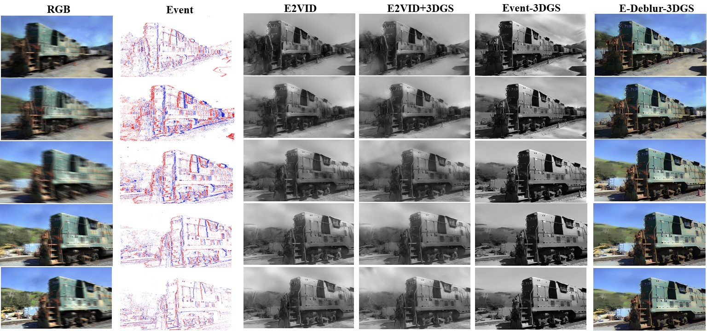

# Event-3DGS: Event-based 3D Reconstruction Using 3D Gaussian Splatting



## Introduction
This repository contains the research code for **Event-3DGS: Event-based 3D Reconstruction Using 3D Gaussian Splatting**, which is accepted by NeurlPS 2024. The video introduction can refer to https://recorder-v3.slideslive.com/?share=92624&s=576b3d56-3c7c-46aa-abdf-1eac1d3a4d1d

The code is designed to implement the event-based 3D reconstruction algorithm described in the paper and includes key components such as the photovoltage contrast estimation module and a novel event-based loss for optimizing reconstruction quality.

The code has been tested in a personal environment on Windows 11. If you encounter any difficult-to-resolve issues during deployment in other environments, please feel free to provide feedback.

## Installation
Follow the steps below to set up the environment and install dependencies.

1. **Clone the repository:**
   ```bash
   git clone https://github.com/lanpokn/Event-3DGS.git
   cd Event-3DGS
   ```

2. **Install the necessary dependencies:**

   This project is based on 3DGS (https://github.com/graphdeco-inria/gaussian-splatting), so please refer to its installation instructions. 

   Some parts of the code in this project use additional libraries, which were mainly my personal attempts during the exploratory phase and **can be ignored during use**.

## Dataset Format
To ensure proper usage, we will introduce the format in which we organize the data.

1. **Data organization :**

   - We organize the data into the following structure:
     ```
     /path/to/dataset/
       ├── images/
       ├── images_event/
       ├── images_blurry/(optional)
       ├── renders/
       ├── sparse/...
     ```

2. **Data Explaination:**

   - The 'images' folder stores the pure intensity images estimated from events. During the optimization process, the images in this folder **are responsible for providing pure intensity**.
   - The 'images_event' folder also stores the pure intensity images estimated from events, but the images in this folder are **solely used to provide intensity differences** during the optimization process. Since the estimation methods for intensity and intensity differences may vary, I separated them when validating the algorithm.
   - 'images_blurry' is optional and contains blurry images captured by an RGB camera, primarily used to validate its deblurring capability as presented in the original paper.
   - 'renders' stores the RGB ground truth, which is prepared for testing and does not participate in the reconstruction process.
   - The entire 'sparse' folder contains the camera poses in COLMAP format. For using COLMAP, please refer to https://colmap.github.io/. If you only have event data without pose or RGB information, you can first estimate the intensity images from the events and then use these intensity images for calibration with COLMAP.

3. **Notification:**

   The image filenames in all storage folders must correspond one-to-one and be consistent with the results stored in COLMAP; otherwise, they will not be readable.

   There are many methods to obtain 'images' and 'images_event,' including but not limited to neural networks, classical integration methods, and filtering methods. You can choose based on your specific situation. If you're unfamiliar with this area, you can refer to https://github.com/ziweiWWANG/AKF and https://github.com/uzh-rpg/rpg_e2vid. For details on our method, please refer to the paper.
4. **Data Example:**
   Here, we provide a simulated dataset (with blurred images and event data simulated based on an existing dataset) for easy debugging. The images and images_event have already been generated based on the simulated events.
   
   The file shared via Baidu Netdisk: `train_colmap_easy.zip`  
   Link: [https://pan.baidu.com/s/1T0a77lgxYaIveNDMBrxr_w](https://pan.baidu.com/s/1T0a77lgxYaIveNDMBrxr_w)  
   Access code: h88z


## Getting Started
Once you've set up the environment and arranged the dataset, you can use train.py to reconstruct the scene.

This file's usage  is generally consistent with the original 3DGS, but I have added more command-line parameters to accommodate my event modality. Specifically:

##### Command-Line Options

- `--event`:    This option enables the event reading and reconstruction mode, which is the primary mode. For specific functionality after enabling this option, please refer to the code.
- `--gray`:    This option changes the 3DGS output to grayscale. It should be enabled in pure event mode, as events are inherently single-channel, and outputting color in this case is meaningless.
- `--deblur`:    This option enables the event-assisted deblurring mode, demonstrating that my algorithm can be used in conjunction with both Event and RGB data. For specific functionality after enabling this option, please refer to the code.

##### Example Use

To provide some examples, below are sample commands corresponding to `launch.json` in VSCode:

```
`"args": ["-s", "your_dataset_path/","--gray","--event","--iterations","8000","-m","your_dataset_path/","--start_checkpoint","your_checkpoint_path"],`
```

## Others(Explanation of minor issues)
- If your training crashes (e.g., the scene disappears), you can first try setting $\alpha$ to 0  and see if the reconstruction succeeds. If reconstruction works at this stage, then consider gradually increasing   $\alpha$ or adjusting  $\alpha$ based on the training step size. In general, reconstruction is more stable when  $\alpha$ is small, and the quality improves as  $\alpha$ increases, but if  $\alpha$ is too large, it may lead to instability in the reconstruction.

  For more details on the parameters, please refer to the paper.

- `Event_sensor` was originally integrated here for event simulation during my experiments. However, I later separated the dataset creation process, so this folder is essentially deprecated. In fact, since the primary purpose of this code project is to validate the proposed algorithm, it’s not very engineering-focused and does not include one-click dataset generation.

- Additionally, since this method is plug-and-play and does not require a training dataset, and I currently do not have a Google Drive account or similar for sharing, I have not provided the dataset. If needed, please discuss it in the issues.

- `ViewDepth.py` is a file I use to read depth maps. Since the original 3DGS lacks the ability to generate depth maps, I added a depth generation feature (enabled with `--depth`) in the `render` function to create depth maps, although this was not included in the paper. In fact, I made significant modifications to `renders.py`, but they were only used for algorithm exploration

## Acknowledgments
We thank the authors of https://github.com/graphdeco-inria/gaussian-splatting and the other open-source libraries used in this work. 
